# Enterprise Agentic RAG Platform

Hybrid retrieval over regulatory filings, biomedical literature and internal
documents, returning answers whose every claim is traceable to the passage it
came from — with the retrieval quality, citation correctness and latency all
measured rather than asserted.

[](https://github.com/Harsham032/enterprise-agentic-rag-platform/actions/workflows/test.yml)
[](https://github.com/Harsham032/enterprise-agentic-rag-platform/actions/workflows/quality.yml)
[](pyproject.toml)
[](LICENSE)

---

## Overview

A retrieval system is easy to demonstrate and hard to trust. This one is built
around the parts that make the difference: a corpus ingested with its structure
intact, retrieval that combines lexical and semantic matching, answers assembled
only from retrieved evidence, citations verified before they are returned, and
an evaluation harness that reports what all of it is actually worth.

Every number in this repository was produced by a script in it, on a corpus
committed to it, and can be reproduced with one command.

## The problem

Analysts reading regulatory filings and clinical literature face the same three
problems, and the usual retrieval demo solves none of them.

**Structure is destroyed at ingestion.** A 10-K is not prose — it is Item 1A
(risk factors), Item 7 (management's discussion), Item 8 (financial statements).
Chunk it on a fixed window and a risk factor is split across two chunks, neither
of which stands alone. Measured here: section-aware chunking reaches
`recall@budget` 0.754 against 0.538 for a fixed window of the same mean size.

**Semantic search alone misses exact terms.** These queries are dense with
identifiers — fiscal years, ticker symbols, us-gaap concept names, gene symbols.
A dense retriever routinely misses a document containing the exact identifier
the query names. Hybrid fusion reaches 0.754 against 0.675 lexical and 0.667
dense alone.

**An answer without a checkable source is not usable.** Not "here are the
documents", but "this claim, that passage" — verified before the answer is
returned, not afterwards.

## Key capabilities

| | |
| --- | --- |
| **Acquisition** | SEC EDGAR (filings, submissions, XBRL facts) and PubMed E-utilities, with the published rate limits and identification requirements enforced in the client; PDF, HTML, Markdown and text uploads |
| **Structure-preserving ingestion** | 10-K Item segmentation, structured-abstract sections, metadata extraction (CIK, fiscal year, PMID, MeSH), section-aware chunking with character offsets |
| **Hybrid retrieval** | BM25 with conservative stemming, dense retrieval over three interchangeable embedding backends, weighted or reciprocal-rank fusion |
| **Learned reranking** | Logistic regression over ten query–document features, trained on held-out-safe splits, with inspectable coefficients |
| **Query planning** | Rule-based decomposition of temporal comparisons, entity comparisons and conjunctions, with entity-scoped retrieval per sub-query |
| **Tool orchestration** | Document search, filing-scoped financial lookup, biomedical search, structured XBRL lookup |
| **Grounded generation** | Extractive span selection with a citation on every claim; an abstractive backend behind the same interface |
| **Citation verification** | Every citation checked against the chunk it points at before the answer is returned |
| **Evaluation** | Recall/precision/NDCG/MRR/MAP, recall at a fixed token budget, citation correctness, groundedness, answer completeness, latency percentiles, bootstrap confidence intervals |
| **Operations** | FastAPI service, Prometheus metrics and alert rules, PostgreSQL schema, Docker, CI |

## Architecture

```mermaid
flowchart LR
    subgraph sources["Sources"]
        direction TB
        S1["SEC EDGAR"]
        S2["PubMed"]
        S3["User documents"]
    end

    subgraph ingest["Ingestion"]
        direction TB
        I1["Parse and clean"]
        I2["Segment sections"]
        I3["Extract metadata"]
        I4["Chunk with offsets"]
    end

    subgraph index["Index"]
        direction TB
        X1["BM25"]
        X2["Embeddings"]
        X3[("PostgreSQL")]
    end

    subgraph request["Request path"]
        direction TB
        R1["Plan and route"]
        R2["Retrieve and fuse"]
        R3["Rerank"]
        R4["Synthesise"]
        R5["Verify citations"]
    end

    sources --> ingest --> index
    index --> request
    R1 --> R2 --> R3 --> R4 --> R5
    R5 --> OUT["Cited answer<br/>+ diagnostics"]
    R5 --> M["Evaluation<br/>and metrics"]
```



Full detail, including the reasoning behind each design decision and what would
change at scale, is in [`docs/architecture.md`](docs/architecture.md).

## Technology

**Core** — Python 3.11+, NumPy, SciPy, scikit-learn, pydantic v2, FastAPI,
SQLAlchemy 2, `rank-bm25`, lxml, BeautifulSoup, pypdf, structlog, tenacity,
prometheus-client, httpx.

**Optional backends** — PostgreSQL with pgvector, Qdrant, Redis,
sentence-transformers, hosted embedding and completion APIs.

**Tooling** — pytest, ruff, black, mypy (strict), pre-commit, Docker, GitHub
Actions.

## Dataset

The benchmark and the test suite both run on a purpose-written evaluation corpus
committed at `data/fixtures/corpus`: 20 documents, roughly 6,800 words, 77
chunks, with 38 labelled queries at `data/fixtures/qrels.json`.

**The documents are fictional.** The companies, studies, journals and figures in
them are invented. They follow the structure of the real sources — 10-K Item
headings, Background/Methods/Results/Conclusions abstracts, the hedged language
filings actually use — so the pipeline is exercised on realistic input.

Two reasons for that choice. The published metrics must be reproducible offline
by anyone who clones the repository, with no credentials and no rate-limited
download. And attributing invented financial figures to real companies, or
invented trial results to real journals, would be worse than any alternative.

What follows: **these numbers characterise this pipeline on this corpus.** They
are not a claim about performance on SEC EDGAR or PubMed at scale, and nothing
here has been measured against live data from either source.
[`docs/results.md`](docs/results.md) section 7 lists every limitation and section
8 lists what would have to be run to lift them.

### Data access

Both upstreams are public, need no API key, and require an identifying contact
address plus adherence to a published rate limit — all enforced in the clients.

```bash
export RAG_SEC_USER_AGENT="Your Name your.email@example.com"
export RAG_NCBI_EMAIL="your.email@example.com"

python scripts/download_data.py sec --ticker AAPL --forms 10-K --limit 2 --facts
python scripts/download_data.py pubmed --term "sickle cell gene therapy" --limit 50
```

Acquired data lands in `data/raw/`, which is git-ignored; CI fails if any
tracked file exceeds 2 MB. Terms, licensing and redistribution position for each
source are in [`docs/data-sources.md`](docs/data-sources.md).

### Data pipeline

```
acquire → parse → clean → segment → extract metadata → chunk → index
```

Each stage is a separate script so its output can be inspected and diffed:

```bash
python scripts/download_data.py sec --ticker AAPL --limit 2   # → data/raw/
python scripts/preprocess.py --input data/raw                 # → data/processed/chunks.jsonl
python scripts/build_index.py --corpus data/raw               # → index + fitted reranker
```

Chunks record their character span in the parent document. That is what lets
relevance judgements be written against document regions rather than chunk ids,
so one set of labels stays valid across every chunking configuration compared in
the benchmark.

## Methodology

**Retrieval.** BM25 over stemmed tokens with the section heading prepended, plus
dense retrieval over L2-normalised embeddings. The default embedding backend is
TF-IDF followed by truncated SVD, fit on the corpus — weaker than a pretrained
bi-encoder, but it needs no model download, no accelerator and no credentials,
which is what makes the benchmark reproducible offline. A sentence-transformer
backend and a hosted API backend sit behind the same protocol.

**Reranking.** Logistic regression over ten features (first-stage scores, query
containment, bigram containment, heading match, chunk length, first-match
position, exact phrase). Negatives are mined from first-stage results, not
sampled at random — random negatives make the task trivially easy and the
learned weights useless.

**Planning.** Rule-based decomposition covering temporal comparisons, entity
comparisons and conjunctions. Each sub-query carries the entity it is about, and
retrieval applies it as a metadata filter; without that, two sub-queries of a
comparison share almost every content word and the system quotes the wrong
company's figures. That bug, and the fact that groundedness scored 1.000 both
before and after it was fixed, is written up in
[`docs/results.md`](docs/results.md).

**Generation.** Extractive by default: spans of two consecutive sentences,
selected by maximal marginal relevance with IDF-weighted query coverage, quoted
verbatim with a citation each. Nothing is paraphrased, so every claim is
attributable by construction.

## Evaluation

Queries are split 50/50 by query id. The training half fits the reranker and
selects the chunking configuration; **every reported number comes from the
held-out half, for every configuration**, including those with no learned
component.

`recall@budget` — recall over the ranking truncated at a fixed 400 evidence
tokens — is the headline metric, because fixed-*k* metrics are not comparable
across chunk sizes: five 250-token chunks return three times the text of five
75-token chunks. Full definitions, threats to validity and what the lexical
answer metrics cannot detect are in
[`docs/methodology.md`](docs/methodology.md).

## Results

Held-out split, 19 queries, 400-token evidence budget, 95 percent bootstrap
intervals:

| Configuration | Recall@budget | Recall@5 | NDCG@5 | MRR | Answer completeness |
| --- | --- | --- | --- | --- | --- |
| `lexical_only` | 0.675 (0.465–0.860) | 0.807 | 0.648 | 0.632 | 0.557 |
| `dense_only` | 0.667 (0.447–0.851) | 0.772 | 0.661 | 0.708 | 0.588 |
| `hybrid_rrf` | 0.693 (0.491–0.868) | 0.798 | 0.643 | 0.648 | 0.583 |
| `hybrid_weighted` | 0.754 (0.553–0.921) | 0.807 | 0.651 | 0.660 | 0.610 |
| **`hybrid_reranked` (default)** | **0.772** (0.605–0.921) | **0.851** | **0.760** | **0.791** | **0.623** |
| `fixed_window_chunking` | 0.544 (0.385–0.706) | 0.544 | 0.516 | 0.677 | 0.588 |

Latency on 4 CPU cores, no accelerator: retrieval p95 8.9 ms, end-to-end p95
50.5 ms.

**Read the intervals before the point estimates.** With 19 held-out queries they
span roughly 0.3 and overlap heavily. Only the chunking-strategy result is
separated clearly enough to call a finding; the rest is directional.

Three results worth stating plainly:

- **Groundedness is 1.000 and that is not an achievement.** The extractive
  synthesiser copies sentences verbatim, so full support is a design guarantee.
  Any other value would be a bug. **Answer completeness (0.623)** is the number
  that measures answer quality.
- **Comparison queries are the clear weakness**: `recall@budget` 0.222 against
  0.875 for single-hop. The aggregate hides it, so it is reported separately.
- **The naive chunking comparison gives the wrong answer.** At each strategy's
  own default, fixed-window chunking appears to win on every fixed-*k* metric.
  It does not — its chunks were simply longer.
  [`docs/results.md`](docs/results.md) section 6 shows the confound and the
  correction.

Reproduce everything:

```bash
python scripts/run_experiment.py --sweep --output-dir reports
```

## API

```bash
uvicorn rag_platform.services.api:app --port 8000
```

| Endpoint | Purpose |
| --- | --- |
| `GET /health` | Readiness and index statistics (database credentials redacted) |
| `POST /query` | Answer a question with verified citations and diagnostics |
| `POST /documents` | Add documents to the index |
| `POST /evaluate` | Score the live index against a judgement file |
| `GET /metrics` | Prometheus exposition |

```bash
curl -s localhost:8000/query -H 'content-type: application/json' -d '{
  "query": "Which turbine supplier concentration risk does Northwind Energy disclose?",
  "top_k": 5
}'
```

Abridged response — a full one for three query types is in
[`examples/sample_query_output.json`](examples/sample_query_output.json):

```json
{
  "answer": "... We depend on a concentrated set of turbine suppliers. [2] Two manufacturers supplied 84 percent of the turbines in our operating fleet, and one of those two supplied every turbine installed at our four largest wind projects. [2]",
  "citations": [
    {
      "marker": 2,
      "label": "Northwind Energy Corporation - 10-K - FY2024 - Item 1A. Risk Factors",
      "quote": "Two manufacturers supplied 84 percent of the turbines in our operating fleet...",
      "support_score": 1.0,
      "verified": true
    }
  ],
  "groundedness": 1.0,
  "tools_used": ["document_search"],
  "diagnostics": {"strategy": "single_hop", "retrieval_ms": 8.2, "generation_ms": 3.1}
}
```

Exposing `/evaluate` is deliberate: it is what makes a retrieval regression
detectable after deployment, not only at benchmark time.

## Local setup

```bash
git clone https://github.com/Harsham032/enterprise-agentic-rag-platform.git
cd enterprise-agentic-rag-platform

make install                 # virtualenv, dependencies, editable install
cp .env.example .env         # optional; defaults work with no edits

make index                   # build the index and fit the reranker
make experiment              # run the benchmark
make serve                   # start the API on :8000
```

Defaults require no external service: SQLite for metadata, an in-process vector
store, and the corpus-fitted embedding backend.

`make help` lists every target.

## Docker

```bash
docker build -t rag-platform:local .
docker run -p 8000:8000 rag-platform:local

docker compose up --build              # API + PostgreSQL
docker compose --profile observability up   # adds Prometheus
```

The image is multi-stage: build dependencies never reach the runtime layer,
which runs as a non-root user with a health check.

**Not built in the environment where the benchmark was run** — no Docker daemon
was available there. The `quality` CI workflow builds the image, starts the
container and asserts that `/health` reports `ok`.

## Testing

```bash
make test        # 226 tests
make coverage    # ~89% statement coverage
make check       # ruff + black + mypy (strict) + tests
```

The suite runs offline with no external service. The SEC and PubMed clients are
tested against recorded upstream payloads through a mock transport, covering
request construction, rate limiting, retry policy and parsing.

The tests that matter most are the end-to-end properties in
`tests/test_pipeline.py`: every citation resolves to returned evidence, index
builds are deterministic, hybrid retrieval is at least as good as either half,
and a comparison query's evidence stays inside the entities it names.

## Reproducibility

- All randomness derives from one seed (`run.seed`, default 20260101): Python's
  RNG, NumPy, the SVD solver, the reranker, the query split, the bootstrap.
- Corpus and judgements are committed; nothing is downloaded at evaluation time.
- The benchmark runs in CI on every change and the report is uploaded as an
  artefact, so published numbers cannot silently drift from the code.
- `tests/test_pipeline.py::test_index_build_is_deterministic` asserts identical
  rankings across rebuilds.

## Repository structure

```
├── configs/default.yaml          pipeline configuration
├── data/
│   ├── fixtures/                 evaluation corpus and relevance judgements
│   └── README.md                 layout, formats, storage estimates
├── deployment/prometheus/        scrape config and alert rules
├── docs/
│   ├── architecture.md           design decisions and their trade-offs
│   ├── methodology.md            metric definitions, splits, threats to validity
│   ├── results.md                measured results and limitations
│   └── data-sources.md           terms, access and redistribution per source
├── examples/                     runnable end-to-end example and saved output
├── notebooks/exploration.ipynb   corpus and retrieval walkthrough
├── scripts/
│   ├── download_data.py          SEC and PubMed acquisition
│   ├── preprocess.py             clean and chunk to JSONL
│   ├── build_index.py            build the index, fit the serving reranker
│   ├── run_experiment.py         the benchmark
│   └── secrets_scan.py           credential scan over tracked files
├── src/rag_platform/
│   ├── agents/                   planner, tools, orchestrator
│   ├── data/                     sources, domain model, persistence, schema
│   ├── evaluation/               metrics, judgements, harness
│   ├── features/                 parsing, cleaning, chunking, metadata
│   ├── generation/               synthesis and citation verification
│   ├── models/                   embedding, reranking, completion backends
│   ├── retrieval/                lexical, dense, hybrid, index
│   ├── services/                 FastAPI application and schemas
│   └── utils/                    text, timing, seeding
└── tests/                        226 tests
```

## Limitations

Stated flatly; the full list with reasoning is in
[`docs/results.md`](docs/results.md) section 7.

1. **The corpus is small and synthetic** — 20 documents, 77 chunks. Nothing here
   predicts behaviour at 100,000 documents.
2. **Nineteen held-out queries cannot separate close configurations.** Intervals
   span about 0.3.
3. **The default embedding backend is latent semantic indexing, not a pretrained
   encoder.** A bi-encoder would very likely do better; it is wired but not
   benchmarked, because it needs a model download.
4. **Answer quality is measured lexically.** These measures cannot detect a
   claim that is faithfully paraphrased but wrong — as the entity-scoping bug
   demonstrated, with groundedness at 1.000 throughout.
5. **Abstractive generation is unmeasured.** Implemented and unit-tested against
   fakes; benchmarking it needs an API key and would make results
   non-reproducible for anyone without one.
6. **No live acquisition was exercised.** The clients are tested against
   recorded payloads; they have not run against the live services, because
   outbound access to both was blocked by policy in the environment used.
7. **The container image was not built** in that environment either. CI builds
   and health-checks it.

## Future improvements

In the order that would most change what is known:

1. Run the same benchmark on live SEC and PubMed data — the acquisition scripts
   already produce corpora in the format the harness reads.
2. Enlarge the judged query set to 150–200 queries, so the comparison becomes
   decisive rather than directional.
3. Benchmark the pretrained bi-encoder against latent semantic indexing on the
   same split, reporting the latency cost alongside the quality gain.
4. Allocate the evidence budget per sub-query rather than dividing a fixed *k*,
   which is the remaining half of the comparison-query weakness.
5. Measure the abstractive path against the extractive baseline on groundedness,
   completeness, latency and citation verification failures.
6. Add near-duplicate documents — consecutive annual filings are close to
   duplicates in the sections that matter, and telling them apart is a large
   share of the real difficulty.

## Licence

MIT. See [LICENSE](LICENSE).
