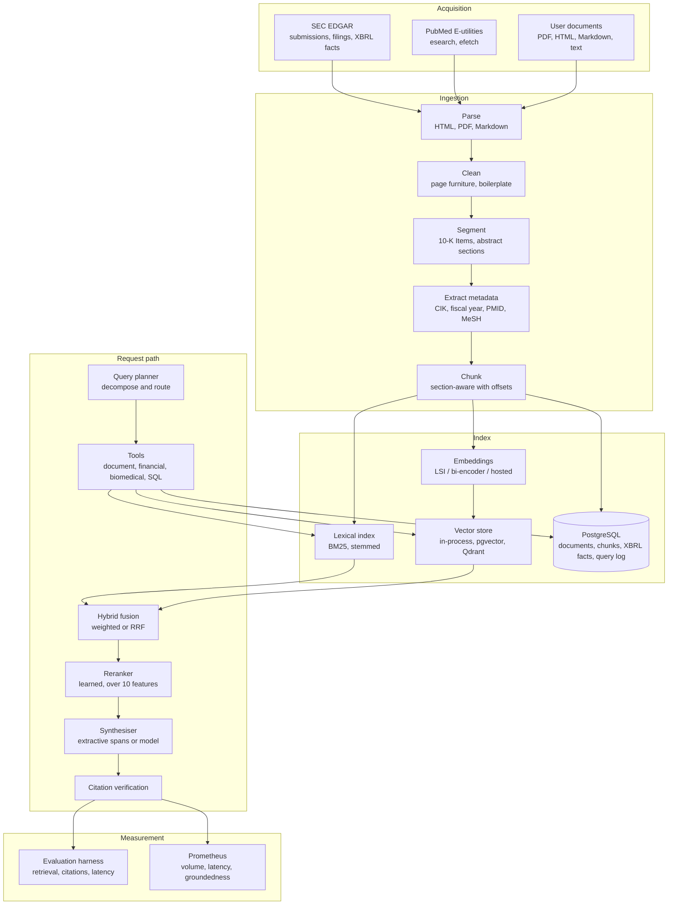

# Architecture

## Pipeline

## Design decisions

Each of these was a real choice with a real alternative. The reasoning matters
more than the conclusion, because the right answer changes with the corpus.

### Hybrid retrieval rather than dense alone

The queries this platform targets are dense with exact identifiers: fiscal
years, ticker symbols, us-gaap concept names, gene symbols, MeSH terms. An exact
term match on those carries more signal than embedding proximity, and a dense
retriever routinely misses a document that uses the identifier the query names.
Lexical retrieval alone fails the opposite way, on paraphrase. Running both and
fusing their scores gets most of each. Measured on the held-out split:
`recall@budget` 0.754 for fusion against 0.675 lexical and 0.667 dense.

Two fusion strategies are implemented because they fail differently. Weighted
fusion min-max normalises each retriever's scores over the candidate pool and
takes a weighted sum, preserving magnitude but exposed to outliers in the BM25
tail. Reciprocal rank fusion ignores magnitude entirely, which is robust to
badly scaled scorers but throws away confidence. Weighted fusion is the default
because it measured better here (0.754 against 0.693); on a corpus with a
heavier BM25 tail that would likely reverse.

### Section-aware chunking

Both filings and structured abstracts carry explicit section structure, and that
structure is semantic: Item 1A is risk disclosure, the Results section of a trial
report is its findings. Chunking within sections keeps a risk factor or a trial
result intact, and carries the section heading into the citation, so a reader
sees "Northwind Energy - 10-K - FY2024 - Item 1A. Risk Factors" rather than a
chunk id.

Measured at matched chunk length this is worth a great deal: `recall@budget`
0.754 against 0.538 for a fixed sliding window of the same mean size. The naive
version of that comparison says the opposite, for reasons set out in
`docs/results.md` section 6.

Every chunk records its character span in the parent document. That is what lets
relevance judgements be written against document regions rather than chunk ids,
so one set of labels stays valid across chunking configurations.

### Latent semantic indexing as the default embedding backend

The default backend is TF-IDF followed by truncated SVD, fit on the corpus being
indexed. It has no world knowledge and is weaker than a pretrained bi-encoder on
vocabulary mismatch. It is the default anyway because it needs no model
download, no accelerator and no credentials, which means the published benchmark
is reproducible offline by anyone who clones the repository. A pretrained
bi-encoder and a hosted embedding API sit behind the same protocol and are one
configuration line away.

The consequence, made explicit because it is easy to miss: a corpus-fitted
backend means query vectors and document vectors must come from the same fitted
projection. Adding documents rebuilds the index rather than appending to it, and
the serving process holds the fitted projection in memory. A pretrained backend
removes that constraint, which is where pgvector and Qdrant fit.

### A learned reranker over features, not a cross-encoder

The reranker is logistic regression over ten cheap query-document features:
first-stage scores, query containment, bigram containment, heading match, chunk
length, position of the first match, exact phrase presence. It trains in
milliseconds, adds roughly 27ms at p95, needs no model download, and its learned
weights are written to `reports/index_build.json` by `make index` - which matters when a
ranking decision has to be explained.

A cross-encoder would very likely rank better. It is implemented behind the same
protocol for deployments that can afford the latency and the download.

Negatives are mined from first-stage results rather than sampled at random,
because random negatives make the task trivially easy and the learned weights
useless.

### Rule-based query planning

"Compare Northwind Energy revenue growth in 2024 against 2023" embedded as one
vector sits between the two things it asks about and retrieves neither well. The
planner splits it into two well-formed sub-queries and routes each.

Decomposition is rule-based, covering three shapes: comparisons across periods,
comparisons between named entities, and conjunctions of independent questions.
Rules are deterministic, free, add no latency, and are auditable when a routing
decision is wrong. A model-backed planner would generalise further, at the cost
of a model call on every request - which doubles end-to-end latency on this
pipeline. It is wired for deployments that want it.

The honest scorecard on this: decomposition works (the strategy is correctly
identified), but comparison queries still score 0.222 against 0.875 for
single-hop, because dividing a fixed evidence budget across sub-queries leaves
each with too little. `docs/results.md` section 7 sets out the fix.

### Extractive generation by default

The default synthesiser selects sentence spans verbatim from retrieved chunks
and attaches a citation to each. Nothing is paraphrased. Three consequences:

* Every claim is attributable by construction, so groundedness is a property of
  the output rather than a hope about it.
* The evaluation harness runs with no credentials, no per-run cost and no
  variance from sampling.
* Answers read as quoted evidence rather than as prose. That is the trade.

Selection uses maximal marginal relevance over spans of two consecutive
sentences. Spans rather than single sentences because lead-in sentences carry
the query vocabulary while the detail sits in what follows - "Three alerts page
the on-call engineer" matches the query, the thresholds are in the next
sentence. Query terms are weighted by inverse document frequency computed over
the candidate pool, so a company name shared by every candidate counts for less
than the term that distinguishes them.

### Citation verification as a pipeline stage

Every citation carries the exact quote it came from and is checked against the
cited chunk before the answer is returned. Verification separates two failure
modes with different causes: a citation that does not resolve to a retrieved
chunk is a plumbing bug, and a citation that resolves but whose quote is absent
points at the wrong passage. Model-generated answers additionally have invented
markers stripped, so an unverifiable reference is never presented as a source.

## Storage

| Data | Store | Why |
| --- | --- | --- |
| Document and chunk metadata | PostgreSQL (SQLite locally) | Relational queries, joins to XBRL facts, cascade delete |
| Chunk embeddings | In-process matrix, or pgvector, or Qdrant | Exact scan is faster than an approximate index below a few hundred thousand chunks |
| XBRL financial facts | PostgreSQL | Exact figures for questions a text index answers badly |
| Query log | PostgreSQL | Makes retrieval quality measurable in production, not only at benchmark time |
| Cache | Redis (optional) | Repeated query and embedding results |

One SQLAlchemy Core schema serves SQLite and PostgreSQL, so the test database
and the deployment database cannot drift. The PostgreSQL-native DDL, including
the pgvector column and HNSW index, is at
`src/rag_platform/data/sql/schema.sql`.

## Observability

Three metric families are exposed at `/metrics`:

| Metric | Type | What it catches |
| --- | --- | --- |
| `rag_queries_total` | counter, labelled by strategy | Volume, and the mix of single-hop against decomposed queries |
| `rag_query_latency_seconds` | histogram | Latency regression |
| `rag_answer_groundedness` | histogram | Retrieval regression, before users report it |

Groundedness is the operationally interesting one. On the extractive path it is
1.0 whenever the pipeline is working, so a sustained drop means the retrieval
stage is returning evidence the answer cannot be built from. Alert rules
implementing the thresholds in `data/fixtures/corpus/internal/retrieval_service_runbook.md`
are at `deployment/prometheus/alerts.yml`.

## Scaling

What would have to change beyond the scale actually measured here (20 documents,
77 chunks). None of this has been tested and it is set out as a design position,
not as a claim:

* **Beyond a few hundred thousand chunks**, the exact dense scan stops being
  cheaper than an approximate index. Move embeddings into Qdrant or pgvector
  with an HNSW index.
* **Beyond a single process**, the corpus-fitted embedding backend has to go.
  A pretrained bi-encoder lets several replicas share one vector store, because
  the projection no longer depends on the corpus.
* **Ingestion** is currently synchronous and rebuilds the index. At volume it
  becomes a queue writing to the vector store, with periodic rebuilds gated on
  the evaluation harness reporting no regression against the standing query set.
* **The reranker** trains on labelled queries. In production the query log is
  the label source: click-through or explicit feedback supplies the judgements
  that `scripts/build_index.py` currently reads from a file.
